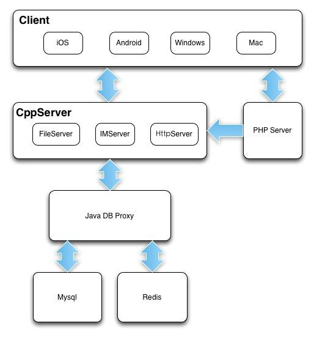

# TeamTalk

opensource im from mogojie(蘑菇街), this is a branch, see [origin](https://github.com/meili/TeamTalk)





## Changed

### Server

### Windows

- 适配vs2017

## Structure

- mac：TTMacClient工程，mac客户端工程
- iOS：TTIOSClient工程，IOS客户端工程
- Android：TTAndroidClient工程，android客户端工程
- Windows：TTWinClient工程，windows客户端工程
- Server: C++服务端工程，CentOs7下编译通过
    - LoginServer (C++): 登录服务器，分配一个负载小的MsgServer给客户端使用
    - MsgServer (C++):  消息服务器，提供客户端大部分信令处理功能，包括私人聊天、群组聊天等
    - RouteServer (C++):  路由服务器，为登录在不同MsgServer的用户提供消息转发功能
    - FileServer (C++): 文件服务器，提供客户端之间得文件传输服务，支持在线以及离线文件传输
    - MsfsServer (C++): 图片存储服务器，提供头像，图片传输中的图片存储服务
    - DBProxy (C++): 数据库代理服务器，提供mysql以及redis的访问服务，屏蔽其他服务器与mysql与redis的直接交互

## Build

server：参考 [README.md](./server/src/README.md)
windows: 参考 [README.md](./win-client/README.md)

## Run

1. 下载客户端，这里已经编译好了windows版本
- [百度网盘，不能多开](https://pan.baidu.com/s/1tjlN_BF1H9QcEEykGbwDbw)，提取码：kt6e
- [多开版](https://pan.baidu.com/s/1DAgeWBooQkGlxHxN90HyZg)，提取码：6b74
2. 解压，双击bin/teamtalk.exe
3. 点击“设置”按钮，设置成自己的服务器IP
```bash
# http://access.teamtalk.im:8080/msg_server
http://your-ip:8080/msg_server
```

4. 输入账号和密码
5. 点击登录